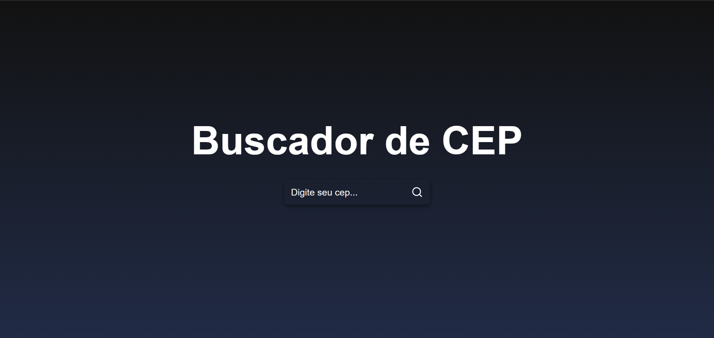

# Buscador de CEP

## Objetivo

Desenvolver uma aplicação web utilizando HTML, CSS e JavaScript que permita ao usuário consultar informações de um CEP informado. A aplicação será integrada a uma API externa, ViaCEP, para buscar dados como logradouro, bairro, cidade e estado, exibindo-os de forma dinâmica na interface.

Funcionalidades Principais:
- Campo de Entrada – Permitir que o usuário insira um CEP para consulta.
- Consumo de API – Fazer uma requisição a uma API externa para obter os dados do CEP.
- Exibição Dinâmica – Apresentar as informações retornadas de forma clara e organizada.
- Validação de Entrada – Garantir que apenas CEPs válidos sejam consultados.
- Estilização Responsiva – Interface amigável e acessível em diferentes dispositivos.

O projeto seguirá boas práticas de desempenho e usabilidade, proporcionando uma experiência fluida ao usuário. 🚀

### Conhecendo o projeto

O projeto que foi criado pode ser visto nas Figuras 1 e 2.

<figure>
  
  <figcaption align="center">
    Figura 1.
    
  Projeto antes da busca.</figcaption>
</figure>

<figure>
   
  <figcaption align="center">
    Figura 2.
    
  Projeto após a busca.</figcaption>
</figure>

Essa Landing Page está dividida em um **topo e duas seções**. Cada seção possui um tipo de informaçõa diferente.

- Informações da Barbearia.

### `npm start`

Para rodar o projeto no modo de desenvolvimento, execute o comando `npm start`.
Abra [http://localhost:3000](http://localhost:3000) para visualizá-lo em seu navegador.

### `deploy`

O deploy da aplicação foi realizado na plataforma [Vercel](https://vercel.com/).
E poderá ser acompanhado através do seguinte link: (https://buscador-cep-rho-nine.vercel.app/).
